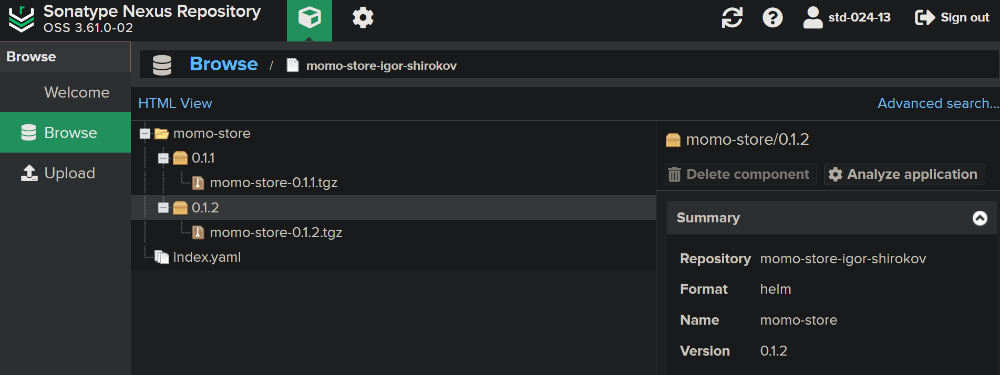
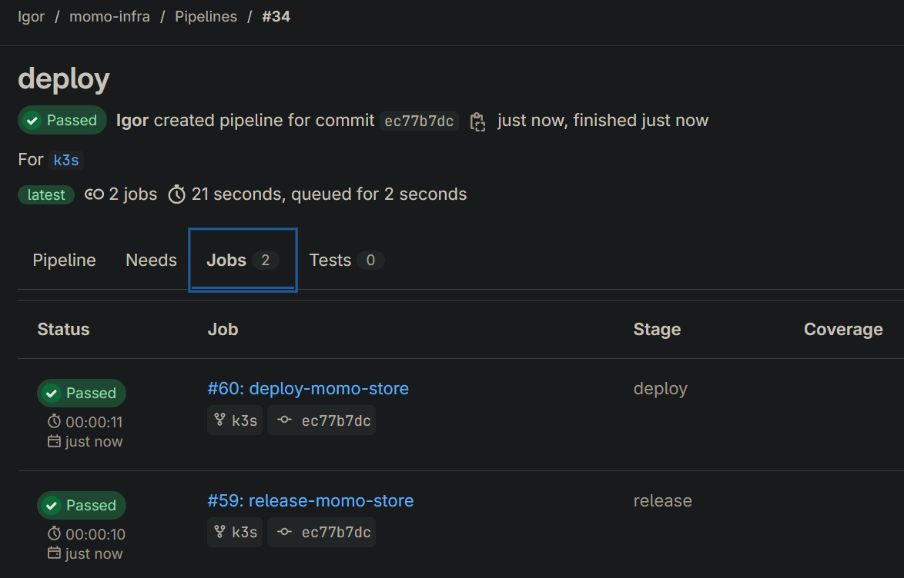
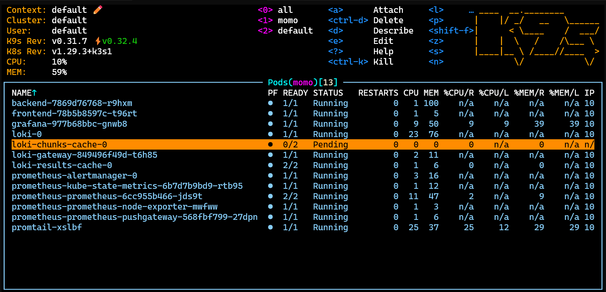
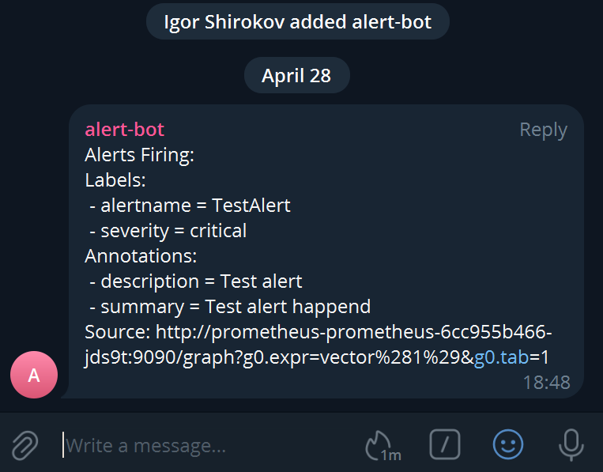
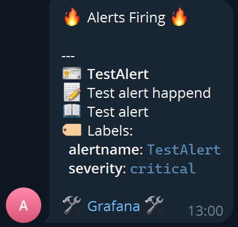
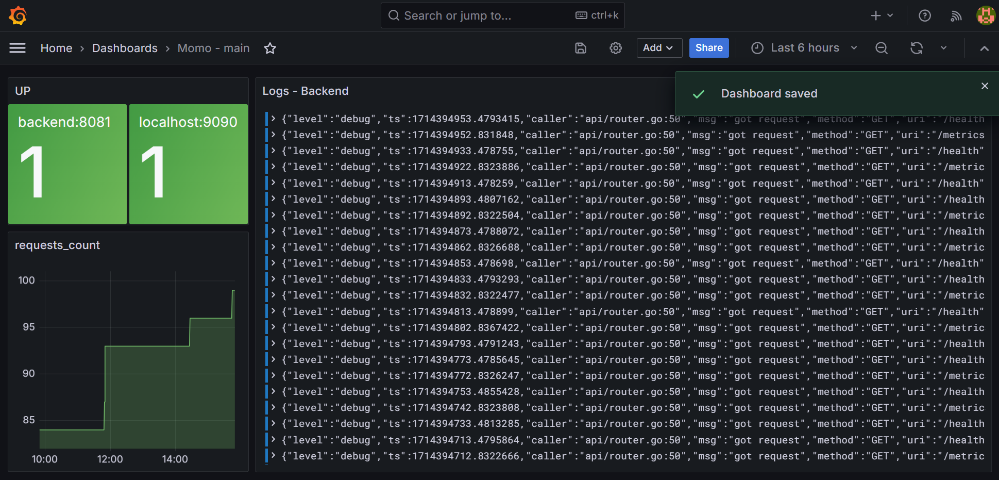

# MOMO-INFRA

## Name

Инфраструктура для онлайн магазина.

## Description

Репозиторий для развёртывания онлайн магазина.

## Installation

### Генерация ssh ключей

- ssh-keygen -t ecdsa -b 256 -f ~/.ssh/k3s_cluster
- ssh-keygen -t ecdsa -b 256 -f ~/.ssh/gitlab

### Настройка репозитория

Если необходимо перенести репозиторий:

```bash
git clone git@gitlab.praktikum-services.ru:Stasyan/momo-store.git
# git remote add new-origin git@gitlab.practi-testing.fun:igor/momo-store.git
git remote add new-origin git@gitlab.practi-testing.fun:igor/momo-infra.git
git push --all new-origin
git push --tags new-origin
git remote rm origin
git remote rename new-origin origin
```

Добавьте новый репозиторий в git config:

```text
Host gitlab.practi-testing.fun
    IdentityFile ~/.ssh/gitlab
    IdentitiesOnly yes
    AddKeysToAgent yes
```

### Terraform

> Предварительно нужно запусить get-token.ps1 чтобы можно было вносить изменения в конфигурацию.

Для применения конфигурации Terraform:

```bash
cd ./terraform
terraform init
terraform plan
terraform apply
```

### Работа с registry **cr.yandex**

```bash
yc iam key create --service-account-name sa -o authorized_key.json
cat authorized_key.json | docker login --username json_key --password-stdin cr.yandex
```

### Доступ к k3s кластеру

Копируем kubeconfig в /.kube чтобы можно было локально работать с кластером.

```bash
mkdir ~/.kube \
    && sudo cp /etc/rancher/k3s/k3s.yaml ~/.kube/config \
    && sudo chown -R $USER:$USER ~/.kube
```

### Доступ к registry **cr.yandex** для k3s

```bash
# Создаем namespace
kubectl create ns momo
kubectl config set-context --current --namespace=momo

# Получение docker-config.json
cat ~/.docker/config.json | base64 -w0 > $HOME/docker-config.json 

# Создаем секрет
kubectl create secret generic yandex-registry \
  --namespace=momo \
  --from-file=.dockerconfigjson=$HOME/docker-config.json \
  --type=kubernetes.io/dockerconfigjson
```

### Установка gitlab

На VM gitlab уже работает Docker Swarm. Нужно применить плэйбук чтобы развернуть gitlab и раннер к нему.

```bash
eval `ssh-agent -s`
ssh-add ~/.ssh/gitlab

# Применить плэйбук
ansible-playbook playbook.yaml

# Работа с секретами потребует .vault с ключем
ansible-vault decrypt ./group_vars/vm-instances/vault.yaml
ansible-vault encrypt ./group_vars/vm-instances/vault.yaml
```

Для добавления runner'ов используйте код:

```bash
# Узанать id runner'а
docker ps --format 'table {{.ID}}\t{{.Names}}'

# Регистрация runner'а
docker exec -it 0d4d7b876697 \
  gitlab-runner register -n \
  --registration-token <token из gitlab> \
  --tls-ca-file=/etc/gitlab/ssl/ca_root.crt \
  --url "https://gitlab.practi-testing.fun/" \
  --executor docker \
  --docker-image "docker:26.0.2" \
  --description "docker" \
  --docker-privileged \
  --docker-volumes "/certs/client"
```

#### Gitlab backup

```bash
# Узанать id контейнера gitlab
docker ps --format 'table {{.ID}}\t{{.Names}}'

docker cp <id контейнера gitlab>:/etc/gitlab/gitlab-secrets.json /var/opt
docker cp <id контейнера gitlab>:/etc/gitlab/gitlab.rb /var/opt
docker cp <id контейнера gitlab>:/var/opt/gitlab/backups/*-ee_gitlab_backup.tar /var/opt
```

### Настройка домена

На сайте на котором получен домен зайдите в *DNS-серверы и управление зоной* и внесите изменение в DNS-серверы:

- ns1.yandexcloud.net
- ns2.yandexcloud.net

### Helm

Развернуть в k3s для тестирования всё можно самостоятельно используя helm.

> Для мониторинга использовались общедоступные чарты с grafana/* и prometheus-community*.

> Не забывайте указывать версию чарта.

```bash
# Поиск доступных чартов
helm search repo <repo/chart-name>

# Тестирование
helm template --debug ...

# Копирование дефолтных values чарта
helm show values <repo/chart-name> > values.yaml

# Магазин
helm upgrade --install --dependency-update --set environment=stage \
--namespace momo --atomic momo-store ./momo-chart

# Grafana
# Пароль из values требуется заменить
kubectl create secret tls grafana-tls \
--key ./grafana.key --cert ./grafana.crt --namespace momo
helm upgrade --install --dependency-update --namespace momo \
--values ./obs/grafana/values.yaml  grafana grafana/grafana

# Prometeus & Alertmanager
helm upgrade --install --dependency-update --namespace momo --values ./obs/prometheus/values.yaml  prometheus prometheus-community/prometheus

# Обновить rules для Alertmanager можно через port-forwarding командой
curl -XPOST http://127.0.0.1:9093/-/reload

# Loki
helm upgrade --install --dependency-update --namespace momo \
--values ./obs/loki/values.yaml loki grafana/loki

# Promtail
helm upgrade --install --dependency-update --namespace momo \
--values ./obs/promtail/values.yaml promtail grafana/promtail
```

В графане в источниках данных адреса loki и prometheus задаются:

- http://prometheus-prometheus.namespace.svc.cluster.local
- http://loki-gateway.namespace.svc.cluster.local

> namespace.svc.cluster.local можно опустить если всё расположено в одном namespace.

Дебаг

```bash
kubectl get events
helm get notes <service>
kubectl logs --namespace=momo deploy/<name>
```

## Visuals













## Authors and acknowledgment

[Игорь Широков](https://github.com/SanYattsu)
