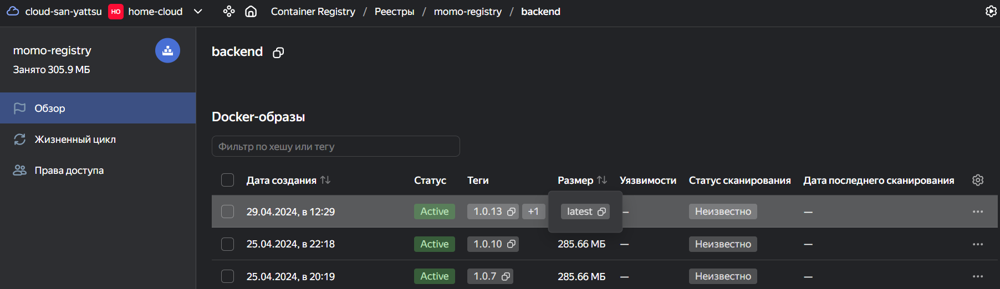

# MOMO-STORE

## Name

Онлайн магазин.

## Description

Онлайн магазин по продаже вкусных пельмешек.

## Installation

Чтобы запустить магазин локально воспользуйтесь командой:

```bash
docker compose up -d

# Проверить статус контейнеров
docker ps --format 'table {{.ID}}\t{{.Names}}\t{{.Status}}'
```

## Visuals





## Authors and acknowledgment

[Игорь Широков](https://github.com/SanYattsu)
